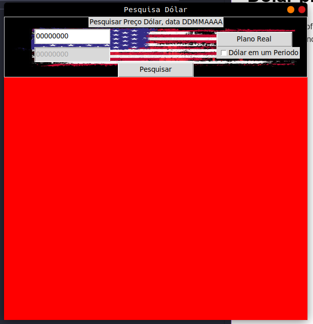
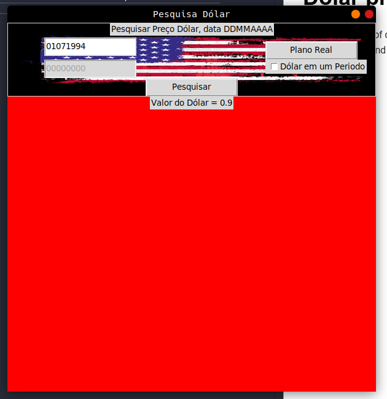
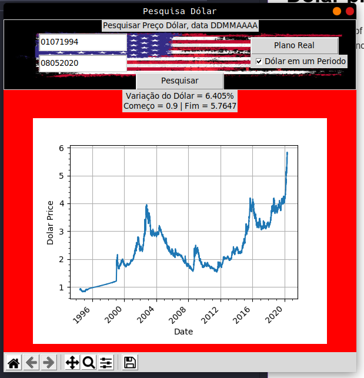

# Dolar price using brazilian currency

shows the price of dolar in brazilian currency based on BCB API.
can be used to find the value on a date or the variation in a period.

## begin state

## single date search

## period search

